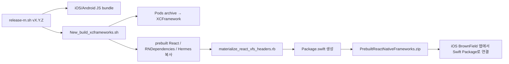

# PopPang RN

PopPang RN은 iOS와 Android에서 공통으로 사용할 화면을 React Native로 개발하는 프로젝트예요.

이 프로젝트에서는 두 가지 작업을 할 수 있어요.

- React Native 데모 앱을 실행해 화면을 개발하고 확인해요.
- iOS와 Android 네이티브 앱에 전달할 bundle과 프레임워크를 만들어요.

## 왜 Prebuild 방식인가요?


이 저장소에서는 React Native 런타임과 네이티브 의존성을 먼저 빌드한 뒤, 클라이언트 앱에 산출물 형태로 전달하는 방식을 `Prebuild`라고 불러요. iOS는 `XCFramework`, Android는 `AAR`과 로컬 Maven 저장소로 패키징해서 배포해요.

이 방식을 택한 이유는 기존 네이티브 앱의 의존성 관리 체계를 흔들지 않기 위해서예요. React Native 공식 문서처럼 앱 프로젝트 안에 React Native를 직접 통합하면 클라이언트 앱도 `CocoaPods`나 React Native 빌드 설정을 함께 가져가야 할 수 있어요. 이미 `Swift Package Manager`, 사내 빌드 시스템, 기존 Gradle 구조를 쓰는 앱에 다른 의존성 관리 방식을 섞으면 중복 의존성, 충돌, 커스텀 히스토리 같은 운영 비용이 커져요. `Prebuild` 방식이면 클라이언트 앱은 React Native 프로젝트 자체를 품지 않아도 되고, 필요한 산출물만 받아 한 가지 통합 경로로 붙일 수 있어요.

## 구조

```text
App.tsx
= Debug에서는 데모 피처 목록을, Release에서는 기본 root feature를 여는 앱 루트

native-entry.js
= iOS / Android 네이티브가 붙이는 RN 진입점

PopPang-RN/
├─ App.tsx                           # 데모 앱 루트
├─ index.js                          # 개발 실행 진입점
├─ native-entry.js                   # 네이티브 앱 삽입용 진입점
├─ src/
│  ├─ PopPangNativeEntry.tsx         # 네이티브 전달값으로 feature 선택
│  ├─ demo/
│  │  └─ DemoFeatureCatalog.tsx      # 데모용 피처 목록
│  └─ Features/
│     ├─ poppangFeatures.ts          # feature 정의와 매핑
│     ├─ PopPangRNRoot/              # 기본 root feature
│     ├─ PopPangAdmin/               # admin feature
│     ├─ PopupRequest/               # 팝업 제보 feature
│     └─ PopupRequestManagement/     # 팝업 제보 관리 feature
├─ react_native_prebuild/
│  └─ iOS용 React Native XCFramework 생성 도구
├─ react_native_android_prebuild/
│  └─ Android용 React Native AAR 및 로컬 Maven 저장소 생성 도구
└─ scripts/
   ├─ bundle-ios.sh
   ├─ bundle-android.sh
   └─ release-rn.sh
```

## 프로젝트는 목적에 따라 진입점을 나눠 사용해요.

| 목적             | 진입점            | 동작                                                   |
| ---------------- | ----------------- | ------------------------------------------------------ |
| 데모 앱 개발     | `index.js`        | `App.tsx`가 데모 피처 목록을 보여줘요                  |
| 네이티브 앱 삽입 | `native-entry.js` | 전달받은 `feature` 값으로 RN 화면을 선택해요           |

## 세팅 방법

```bash
# 1. 저장소 복제
git clone https://github.com/team-PopPang/PopPang-RN.git

# 2. 프로젝트 폴더로 이동
cd PopPang-RN

# 3. 의존성 설치
npm ci
```

> 라이브러리를 추가하거나 삭제할 때만 `npm install`을 사용해요.  
> 그 외 개발 환경 설치와 릴리즈 빌드에는 `npm ci`를 사용해요.

## Demo 앱 실행 방법

```bash
# 1. Metro 개발 서버 실행
npm run start

# 2. 새 터미널에서 iOS 데모 앱 실행
npm run ios

# 3. 새 터미널에서 Android 데모 앱 실행
npm run android
```

## 실제 기기로 실행 방법
```bash
# 연결 확인

# 연결된 실제 기기 목록에서 선택
npm run ios -- --list-devices

# 기기 이름으로 실행
npm run ios -- --device "i"

# 현재 표시된 UDID로 실행
npm run ios -- --device "00008130-00090C281A38001C"
```

## 모듈 배포 방법

```bash
# ./scripts/release-rn.sh 버전명
./scripts/release-rn.sh v0.1.0
```

릴리즈에는 플랫폼별 JavaScript bundle과 함께 다음 네이티브 패키지가 포함돼요.

- iOS: `poppang-rn-spm-v0.1.0.zip`
- Android: `poppang-rn-android-maven-v0.1.0.zip`

Android 네이티브 패키지만 로컬에서 확인할 때는 아래 스크립트를 사용해요.

```bash
./react_native_android_prebuild/build_aars.sh v0.1.0
```

## 지원 모듈과 파라미터

네이티브 클라이언트에 제공하는 모듈은 두 가지예요. iOS와 Android 모두 같은 `feature`, `userUuid`, `nativeEvents` 값을 전달해요.

| 화면 | `feature` 값 | `userUuid` 용도 | 지원 네이티브 이벤트 |
| --- | --- | --- | --- |
| 팝업 제보 | `request` | 제보자를 식별해요. 비어 있으면 제보할 수 없어요. | `popupRequestSubmitted`, `popupRequestBack` |
| 팝업 제보 관리 | `request-management` | 관리자 API 요청에 사용할 관리자 UUID예요. | `popupRequestManagementBack` |

| 파라미터 | 타입 | 필수 | 설명 |
| --- | --- | --- | --- |
| `feature` | 문자열 | 예 | 위 표의 정확한 모듈 값을 전달해요. |
| `userUuid` | 문자열 | 예 | 로그인한 사용자의 UUID를 전달해요. 팝업 제보 관리에는 관리자 UUID를 사용해요. |
| `nativeEvents` | 문자열 배열 | 아니요 | RN이 네이티브로 전달할 이벤트를 제한해요. `popupRequestSubmitted`, `popupRequestBack`, `popupRequestManagementBack`를 지원해요. |

iOS는 `moduleName`에 항상 `PopPangRNRoot`를 넣고, `initialProperties`로 세 파라미터를 전달해요. Android는 `PopPangRnSdk.createIntent`가 같은 값을 전달해요. `feature`를 생략하거나 지원하지 않는 값을 넣으면 기본 root 화면이 열리므로, 클라이언트 앱에서는 위 두 값만 사용해요.

`popupRequestSubmitted`는 팝업 제보 API가 성공하고 사용자가 완료 Alert의 `확인`을 누를 때만 발생해요. `popupRequestBack`은 팝업 제보의 RN 커스텀 헤더에서 뒤로가기 버튼을 누를 때 발생해요. `popupRequestManagementBack`은 팝업 제보 관리 목록의 같은 버튼에서 발생해요. `nativeEvents`에서 해당 값을 빼면 RN은 그 이벤트를 네이티브 모듈로 전달하지 않고, 각 화면의 뒤로가기 버튼도 표시하지 않아요.

## 클라이언트 앱(Android)

Android 패키지는 `poppang-rn-android` SDK AAR, npm 네이티브 모듈 AAR, React Native와 Hermes를 포함한 폴더형 Maven 저장소예요. SDK는 RN C++ ABI에 맞춘 debug/release AAR을 함께 제공하고 Gradle이 앱 빌드 타입에 맞는 변형을 자동 선택해요. 클라이언트 앱에는 `node_modules`나 React Native Gradle Plugin이 필요하지 않아요.

Android 클라이언트 앱에서는 아래 스크립트를 `scripts/download-rn-release.sh`로 두면 돼요. 지정한 릴리즈 버전의 Maven 저장소와 Android bundle을 한 번에 내려받아 적용할 수 있어요.

<details>
<summary>다운로드 스크립트 전체 보기</summary>

```bash
#!/usr/bin/env bash
set -euo pipefail

VERSION="${1:-v0.1.0}"
SDK_VERSION="${VERSION#v}"

REPO="team-PopPang/PopPang-RN"

MAVEN_ASSET_NAME="poppang-rn-android-maven-$VERSION.zip"
BUNDLE_ASSET_NAME="poppang-rn-android-bundle-$VERSION.zip"

ROOT_DIR="$(cd "$(dirname "$0")/.." && pwd)"

MAVEN_OUTPUT_DIR="$ROOT_DIR/Vendor/PopPangRN"
BUNDLE_OUTPUT_DIR="$ROOT_DIR/app/src/main/assets"
TMP_DIR="$ROOT_DIR/.rn-release-temp"

cleanup() {
  rm -rf "$TMP_DIR"
}
trap cleanup EXIT

echo "RN Android 릴리즈 다운로드 시작: $VERSION"

rm -rf "$TMP_DIR"
mkdir -p "$TMP_DIR"

echo "Android Maven 저장소 다운로드"
gh release download "$VERSION" \
  --repo "$REPO" \
  --pattern "$MAVEN_ASSET_NAME" \
  --dir "$TMP_DIR" \
  --clobber

echo "Android bundle 다운로드"
gh release download "$VERSION" \
  --repo "$REPO" \
  --pattern "$BUNDLE_ASSET_NAME" \
  --dir "$TMP_DIR" \
  --clobber

echo "압축 해제"
mkdir -p "$TMP_DIR/maven" "$TMP_DIR/bundle"
unzip -q "$TMP_DIR/$MAVEN_ASSET_NAME" -d "$TMP_DIR/maven"
unzip -q "$TMP_DIR/$BUNDLE_ASSET_NAME" -d "$TMP_DIR/bundle"

if [[ ! -d "$TMP_DIR/maven/repository" ]]; then
  echo "Maven repository를 찾을 수 없습니다." >&2
  exit 1
fi

if [[ ! -f "$TMP_DIR/bundle/android/index.android.bundle" ]]; then
  echo "index.android.bundle을 찾을 수 없습니다." >&2
  exit 1
fi

echo "Maven 저장소 적용"
rm -rf "$MAVEN_OUTPUT_DIR"
mkdir -p "$MAVEN_OUTPUT_DIR"
cp -R "$TMP_DIR/maven/repository" "$MAVEN_OUTPUT_DIR/repository"

echo "Android bundle 적용"
mkdir -p "$BUNDLE_OUTPUT_DIR"
cp \
  "$TMP_DIR/bundle/android/index.android.bundle" \
  "$BUNDLE_OUTPUT_DIR/index.android.bundle"

echo "다운로드 및 적용 완료"
echo "Maven 저장소: $MAVEN_OUTPUT_DIR/repository"
echo "Android bundle: $BUNDLE_OUTPUT_DIR/index.android.bundle"
echo "Gradle SDK 버전: $SDK_VERSION"
```

```bash
# 실행 권한 추가
chmod +x scripts/download-rn-release.sh

# v0.1.0 릴리즈 다운로드 및 적용
./scripts/download-rn-release.sh v0.1.0
```

앱 모듈 이름이 `app`이 아니면 스크립트의 `BUNDLE_OUTPUT_DIR`을 실제 모듈 경로에 맞게 바꿔요.

</details>

<details>
<summary>스크립트 없이 Android에 직접 적용하기</summary>

스크립트를 쓰지 않는 경우에는 아래 순서로 직접 적용할 수 있어요.

1. `poppang-rn-android-maven-v0.1.0.zip`은 앱 저장소의 `Vendor/PopPangRN`에 압축을 풀어요.
2. `poppang-rn-android-bundle-v0.1.0.zip`의 `index.android.bundle`은 앱의 `src/main/assets`에 복사해요.
3. `settings.gradle`에는 로컬 Maven 저장소를 등록해요.

```gradle
dependencyResolutionManagement {
    repositories {
        google()
        mavenCentral()
        maven {
            url = uri("$rootDir/Vendor/PopPangRN/repository")
        }
    }
}
```

앱 모듈에는 PopPang SDK 의존성 한 개만 추가해요.

```gradle
dependencies {
    implementation("com.poppang:poppang-rn-android:0.1.0")
}
```

React Native 화면은 SDK가 제공하는 Intent로 열어요. 네이티브 이벤트를 받으려면 `ActivityResultLauncher`로 열고, 필요한 값을 `nativeEvents`에 넣어요.

```kotlin
import android.app.Activity
import androidx.activity.result.contract.ActivityResultContracts
import com.poppang.rn.PopPangRnSdk

val userUuid = "로그인한-사용자-UUID"

private val popupRequestLauncher =
    registerForActivityResult(ActivityResultContracts.StartActivityForResult()) { result ->
        val eventName = result.data?.getStringExtra(PopPangRnSdk.EXTRA_EVENT)

        if (result.resultCode == Activity.RESULT_OK) {
            when (eventName) {
                PopPangRnSdk.NativeEvent.POPUP_REQUEST_SUBMITTED -> {
                    // 팝업 제보 완료 뒤 필요한 화면 갱신이나 닫기 동작을 실행해요.
                }
                PopPangRnSdk.NativeEvent.POPUP_REQUEST_BACK -> {
                    // RN 팝업 제보 헤더의 뒤로가기 요청을 처리해요.
                }
                else -> Unit
            }
        }
    }

// 팝업 제보 화면 열기와 완료·뒤로가기 이벤트 수신
popupRequestLauncher.launch(
    PopPangRnSdk.createIntent(
        this,
        "request",
        userUuid,
        setOf(
            PopPangRnSdk.NativeEvent.POPUP_REQUEST_SUBMITTED,
            PopPangRnSdk.NativeEvent.POPUP_REQUEST_BACK,
        ),
    )
)

private val popupRequestManagementLauncher =
    registerForActivityResult(ActivityResultContracts.StartActivityForResult()) { result ->
        val eventName = result.data?.getStringExtra(PopPangRnSdk.EXTRA_EVENT)

        if (
            result.resultCode == Activity.RESULT_OK &&
            eventName == PopPangRnSdk.NativeEvent.POPUP_REQUEST_MANAGEMENT_BACK
        ) {
            // RN 관리 목록의 뒤로가기 요청을 처리해요.
        }
    }

// 팝업 제보 관리 화면 열기와 RN 커스텀 헤더의 뒤로가기 이벤트 수신
popupRequestManagementLauncher.launch(
    PopPangRnSdk.createIntent(
        this,
        "request-management",
        userUuid,
        setOf(PopPangRnSdk.NativeEvent.POPUP_REQUEST_MANAGEMENT_BACK),
    )
)
```

`feature`와 `userUuid`를 모두 전달해야 해요. Android SDK는 `feature`를 문자열로 받고, 이벤트가 필요할 때만 네 번째 인자로 `nativeEvents` 집합을 받아요. 팝업 제보 완료·뒤로가기나 관리 목록의 뒤로가기 요청을 처리하려면 위처럼 `ActivityResultLauncher`를 사용해야 해요.

</details>

## 클라이언트 앱(iOS)

- iOS 클라이언트 앱에서는 아래 스크립트를 `scripts/download-rn-release.sh`로 두면 돼요.
- 이 스크립트로 지정한 릴리즈 버전의 iOS bundle과 SPM 패키지를 내려받아 앱에 적용할 수 있어요.

<details>
<summary>다운로드 스크립트 전체 보기</summary>

```bash
#!/bin/bash
set -euo pipefail

VERSION="${1:-v0.1.0}"

REPO="team-PopPang/PopPang-RN"

BUNDLE_ASSET_NAME="poppang-rn-ios-bundle-$VERSION.zip"
FRAMEWORK_ASSET_NAME="poppang-rn-spm-$VERSION.zip"

ROOT_DIR="$(cd "$(dirname "$0")/.." && pwd)"

BUNDLE_OUTPUT_DIR="$ROOT_DIR/PopPangBrownField/Resources/ReactNative"
FRAMEWORK_OUTPUT_DIR="$ROOT_DIR/PopPangBrownField/Vendor/PrebuiltReactNativeFrameworks"

TMP_DIR="$ROOT_DIR/.rn-release-temp"

echo "RN 릴리즈 다운로드 시작: $VERSION"

rm -rf "$TMP_DIR"
mkdir -p "$TMP_DIR"

echo "iOS 번들 다운로드"
gh release download "$VERSION" \
  --repo "$REPO" \
  --pattern "$BUNDLE_ASSET_NAME" \
  --dir "$TMP_DIR" \
  --clobber

echo "SPM 패키지 다운로드"
gh release download "$VERSION" \
  --repo "$REPO" \
  --pattern "$FRAMEWORK_ASSET_NAME" \
  --dir "$TMP_DIR" \
  --clobber

echo "iOS 번들 압축 해제"
mkdir -p "$TMP_DIR/bundle"
unzip -o "$TMP_DIR/$BUNDLE_ASSET_NAME" -d "$TMP_DIR/bundle"

echo "SPM 패키지 압축 해제"
mkdir -p "$TMP_DIR/frameworks"
unzip -o "$TMP_DIR/$FRAMEWORK_ASSET_NAME" -d "$TMP_DIR/frameworks"

echo "iOS 번들 복사"
rm -rf "$BUNDLE_OUTPUT_DIR"
mkdir -p "$BUNDLE_OUTPUT_DIR"

cp "$TMP_DIR/bundle/ios/main.jsbundle" "$BUNDLE_OUTPUT_DIR/main.jsbundle"

if [ -d "$TMP_DIR/bundle/ios/assets" ]; then
  cp -R "$TMP_DIR/bundle/ios/assets" "$BUNDLE_OUTPUT_DIR/assets"
fi

echo "프레임워크 패키지 복사"
rm -rf "$FRAMEWORK_OUTPUT_DIR"
mkdir -p "$(dirname "$FRAMEWORK_OUTPUT_DIR")"

ditto \
  "$TMP_DIR/frameworks/PrebuiltReactNativeFrameworks" \
  "$FRAMEWORK_OUTPUT_DIR"

rm -rf "$TMP_DIR"

echo "다운로드 및 적용 완료"
echo "번들 위치: $BUNDLE_OUTPUT_DIR"
echo "프레임워크 위치: $FRAMEWORK_OUTPUT_DIR"
```

```bash
# 실행 권한 추가
chmod +x scripts/download-rn-release.sh

# v0.1.0 릴리즈 다운로드 및 적용
./scripts/download-rn-release.sh v0.1.0
```

</details>

<details>
<summary>SwiftUI에서 React Native 화면 열기</summary>

### 준비

- 다운로드한 `PrebuiltReactNativeFrameworks` SPM 패키지는 앱 타겟에 연결해 둬요.
- `Resources/ReactNative` 폴더에는 `main.jsbundle`과 `assets/`를 함께 유지해요.
- `main.jsbundle`만 `Copy Bundle Resources`에 추가하면 React Native 이미지 에셋의 하위 경로가 사라져요. `Resources/ReactNative`를 Xcode 프로젝트에 폴더 참조(파란 폴더)로 추가하고 앱 타겟의 `Copy Bundle Resources`에 포함해요.
- `native-entry.js`에서 등록한 모듈 이름과 Swift의 `moduleName`은 같아야 해요.
- 팝업 제보 완료 이벤트를 처리하려면 SPM 패키지가 제공하는 `PopPangReactNativeHost` 모듈을 앱 타겟에 연결해요.

파일 시스템 동기화 그룹만 사용하는 Xcode 프로젝트에서는 폴더 안의 파일이 앱 루트에 평탄화될 수 있어요. 반드시 폴더 참조를 사용해 `ReactNative/assets/...` 경로를 유지해요.

```text
native-entry.js
  → PopPangRNRoot 등록
  → 내부에서 initialProperties.feature로 request/request-management 선택
  → initialProperties.userUuid를 각 feature로 전달
  → initialProperties.nativeEvents에 있는 이벤트만 네이티브로 전달

Swift
  → moduleName: "PopPangRNRoot"
```

### 구현

```swift
import SwiftUI
import UIKit
import React
import React_RCTAppDelegate
import ReactAppDependencyProvider
import PopPangReactNativeHost

// Debug에서는 Metro를, Release에서는 앱에 포함한 main.jsbundle을 사용한다.
final class ReactNativeDelegate: RCTDefaultReactNativeFactoryDelegate {
    override func sourceURL(for bridge: RCTBridge) -> URL? {
        bundleURL()
    }

    override func bundleURL() -> URL? {
#if DEBUG
        return RCTBundleURLProvider.sharedSettings()
            .jsBundleURL(forBundleRoot: "index")
#else
        if let url = Bundle.main.url(
            forResource: "main",
            withExtension: "jsbundle",
            subdirectory: "ReactNative"
        ) {
            return url
        }

        if let url = Bundle.main.url(
            forResource: "main",
            withExtension: "jsbundle"
        ) {
            return url
        }

        fatalError(
            """
            main.jsbundle을 찾을 수 없습니다.
            Build Phases > Copy Bundle Resources 설정을 확인해 주세요.
            """
        )
#endif
    }
}

// React Native Factory와 Delegate를 화면이 살아 있는 동안 유지한다.
final class ReactViewController: UIViewController {
    private let moduleName: String
    private let initialProperties: [String: Any]?

    private var reactNativeFactory: RCTReactNativeFactory?
    private var reactNativeFactoryDelegate: RCTReactNativeFactoryDelegate?

    init(
        moduleName: String,
        initialProperties: [String: Any]? = nil
    ) {
        self.moduleName = moduleName
        self.initialProperties = initialProperties
        super.init(nibName: nil, bundle: nil)
    }

    @available(*, unavailable)
    required init?(coder: NSCoder) {
        fatalError("init(coder:) has not been implemented")
    }

    override func viewDidLoad() {
        super.viewDidLoad()

        let delegate = ReactNativeDelegate()
        delegate.dependencyProvider = RCTAppDependencyProvider()

        let factory = RCTReactNativeFactory(delegate: delegate)

        reactNativeFactoryDelegate = delegate
        reactNativeFactory = factory

        view = factory.rootViewFactory.view(
            withModuleName: moduleName,
            initialProperties: initialProperties
        )
    }
}

// UIKit 기반 React Native 화면을 SwiftUI에서 사용할 수 있게 감싼다.
struct ReactNativeScreen: UIViewControllerRepresentable {
    let moduleName: String
    let initialProperties: [String: Any]?
    let onNativeEvent: ((String) -> Void)?

    init(
        moduleName: String,
        initialProperties: [String: Any]? = nil,
        onNativeEvent: ((String) -> Void)? = nil
    ) {
        self.moduleName = moduleName
        self.initialProperties = initialProperties
        self.onNativeEvent = onNativeEvent
    }

    func makeUIViewController(context: Context) -> ReactViewController {
        PopPangHostAction.setEventHandler(onNativeEvent)

        return ReactViewController(
            moduleName: moduleName,
            initialProperties: initialProperties
        )
    }

    func updateUIViewController(
        _ uiViewController: ReactViewController,
        context: Context
    ) {}

    static func dismantleUIViewController(
        _ uiViewController: ReactViewController,
        coordinator: ()
    ) {
        PopPangHostAction.setEventHandler(nil)
    }
}

struct ContentView: View {
    @State private var isPopupRequestPresented = false

    var body: some View {
        Button("팝업 제보하기") {
            isPopupRequestPresented = true
        }
        .fullScreenCover(isPresented: $isPopupRequestPresented) {
            ReactNativeScreen(
                moduleName: "PopPangRNRoot",
                initialProperties: [
                    "feature": "request",
                    "userUuid": "로그인한-사용자-UUID",
                    "nativeEvents": [
                        "popupRequestSubmitted",
                        "popupRequestBack"
                    ]
                ],
                onNativeEvent: { eventName in
                    guard
                        eventName == PopPangNativeEventPopupRequestSubmitted ||
                            eventName == PopPangNativeEventPopupRequestBack
                    else {
                        return
                    }

                    isPopupRequestPresented = false
                }
            )
            .ignoresSafeArea()
        }
    }
}
```

`PopPangHostAction`은 현재 표시 중인 React Native 화면 하나에 이벤트 핸들러를 연결해요. `fullScreenCover`가 사라질 때 `dismantleUIViewController`가 핸들러를 비우므로, 완료 이벤트가 다음 화면으로 전달되지 않아요.

팝업 제보 관리 화면은 관리자 UUID와 함께 아래처럼 열어요. SwiftUI 기본 내비게이션 바는 숨기고, RN 커스텀 헤더의 뒤로가기 이벤트를 받으면 `NavigationStack`을 pop해요.

```swift
@State private var navigationPath: [Destination] = []

NavigationStack(path: $navigationPath) {
    NavigationLink("팝업 제보 관리", value: Destination.popupRequestManagement)
        .navigationDestination(for: Destination.self) { destination in
            switch destination {
            case .popupRequestManagement:
                ReactNativeScreen(
                    moduleName: "PopPangRNRoot",
                    initialProperties: [
                        "feature": "request-management",
                        "userUuid": "로그인한-관리자-UUID",
                        "nativeEvents": ["popupRequestManagementBack"]
                    ],
                    onNativeEvent: { eventName in
                        guard eventName == PopPangNativeEventPopupRequestManagementBack else {
                            return
                        }

                        if !navigationPath.isEmpty {
                            navigationPath.removeLast()
                        }
                    }
                )
                .toolbar(.hidden, for: .navigationBar)
            }
        }
}
```

### 동작 방식

```text
Debug
Metro의 index.js 로드
  → App.tsx
  → DemoFeatureCatalog 표시
  → 선택한 feature 표시

Release
앱에 포함된 main.jsbundle 로드
  → native-entry.js
  → initialProperties.feature, initialProperties.userUuid, initialProperties.nativeEvents 확인
  → request 또는 request-management 화면 표시
```

</details>

## 의존성 추가

<details>
<summary>의존성 추가 방법</summary>

새 라이브러리는 프로젝트 루트의 `package.json`에만 추가해요.  
`npm install`을 실행하면 `package.json`과 `package-lock.json`이 함께 갱신돼요.

### 앱 실행에 필요한 라이브러리

React Native 화면에서 사용하는 라이브러리는 `dependencies`에 추가해요.

```bash
npm install react-native-safe-area-context
```

### 개발 도구

테스트, 린트, 빌드 도구는 `devDependencies`에 추가해요.

```bash
npm install --save-dev eslint-plugin-import
```

`react_native_prebuild/`에는 의존성을 추가하지 않아요.  
이 폴더는 프로젝트 루트의 `node_modules`를 사용해 iOS용 XCFramework를 만들어요.

`react_native_android_prebuild/`도 별도 npm 의존성을 갖지 않아요.

루트 `node_modules`에서 Android 네이티브 모듈을 찾아 AAR와 Maven metadata를 자동 생성해요.

</details>

## 참고

```bash
# 새 라이브러리를 추가하거나 삭제할 때는 `npm install`을 사용해요.
# 라이브러리 추가
npm install react-native-safe-area-context

# 라이브러리 삭제
npm uninstall react-native-safe-area-context
```

> 라이브러리를 추가하거나 삭제할 때만 `npm install`을 사용해요.  
> 그 외 개발 환경 설치와 릴리즈 빌드에는 `npm ci`를 사용해요.

## 문제 해결

### React Native Core가 예전 레퍼런스와 다른 점

CocoaPods 없이 React Native를 구성하는 방법을 찾다가 좋은 레퍼런스를 발견했어요. 예를 들어 [CocoaPods 없이 React Native 개발하기](https://toss.tech/article/react-native-without-cocoapods)는 RN `0.76` 기준으로 `react_native_prebuild` 안에 별도 의존성을 두고 `yarn`, `pod install`로 XCFramework를 만드는 방식을 다뤄요.

하지만 최신 버전에서는 구조가 달랐어요. React Native `0.84.0`부터 iOS에서는 React Native Core precompiled binary가 기본값이 됐고, 이 저장소가 사용하는 `react-native@0.86.0`도 그 구조를 따라요. 그래서 예전 레퍼런스만으로는 현재의 `React-Core-prebuilt`, `RCT_USE_PREBUILT_RNCORE`, `RCT_USE_RN_DEP` 흐름을 바로 가져오기 어려웠어요.

그래서 이 저장소는 배포용 `react_native_prebuild/`에서 루트 `node_modules`를 의존성 원본으로 유지하고, `RCT_USE_PREBUILT_RNCORE=0`과 `RCT_USE_RN_DEP=0`으로 `React Core`와 `ReactNativeDependencies`를 source-build하는 방식으로 맞췄어요. 대신 Hermes는 Pods가 설치한 `hermesvm.xcframework`를 최종 패키지에 포함해요.

### Metro 캐시 초기화

```bash
pkill -f "react-native/cli.js start" || true
watchman watch-del-all || true
rm -rf $TMPDIR/metro-* $TMPDIR/haste-map-*

npm start -- --reset-cache
```

### iOS Pods 초기화

```bash
rm -rf ios/Pods ios/build
rm -rf ~/Library/Developer/Xcode/DerivedData/PopPangRN-*

cd ios
bundle exec pod install
cd ..

npm run ios
```

### Android 캐시 초기화

```bash
cd android
./gradlew --stop
cd ..

rm -rf ~/.gradle/caches/9.3.1/transforms
rm -rf android/.gradle android/build android/app/build

cd android
./gradlew assembleDebug --refresh-dependencies
cd ..

npm run android
```

### iOS 사진 선택 후 이미지 업로드가 4307로 실패하는 경우

RN 이미지 선택기는 사진 앱의 원본 경로를 애플리케이션에 직접 전달하지 않아요. 선택한 사진을 앱 전용 임시 저장소에 준비한 뒤 URI, 파일명, MIME 타입을 반환해요. 이 과정에서 iOS가 전달할 이미지 표현을 고르므로 원본 사진 정보와 임시 파일 정보가 다를 수 있어요.

PopPang 백엔드는 업로드 이미지의 파일 확장자와 MIME 타입을 함께 검사해요.

| 파일 확장자 | MIME 타입 |
| --- | --- |
| `.jpg`, `.jpeg` | `image/jpeg` |
| `.png` | `image/png` |
| `.heic` | `image/heic` |
| `.heif` | `image/heif` |

PopupRequest에서는 사진 선택 시 `assetRepresentationMode: 'current'`를 사용해 현재 이미지 표현을 요청해요. 선택 결과는 업로드 전에 다음 규칙으로 검증해요.

- `image/jpg`는 표준 MIME 타입인 `image/jpeg`로 정규화해요.
- 대문자 확장자는 소문자로 비교해요.
- 파일명이 없으면 MIME 타입과 일치하는 임시 업로드 이름을 만들어요.
- 확장자와 MIME 타입이 일치하지 않거나 지원하지 않는 형식이면 업로드하지 않고 사용자에게 안내해요.
- 이미지 데이터는 JPEG로 변환하거나 재압축하지 않으므로 화질은 변경되지 않아요.

파일명만 `.jpg`로 바꾸거나 MIME 타입만 `image/jpeg`로 덮어쓰면 이미지 데이터와 메타데이터가 달라질 수 있어요. 그래서 불일치 파일은 임의로 수정하지 않고 선택 단계에서 차단해요.

### iOS 링크 오류가 발생하는 경우

아래처럼 `Undefined symbol` 오류가 발생하면, 추가한 네이티브 라이브러리가 사용하는 iOS 시스템 프레임워크가 Swift Package에 링크되지 않았는지 확인해요.

```text
Undefined symbol: _OBJC_CLASS_$_PHPhotoLibrary
Undefined symbol: _OBJC_CLASS_$_AVAssetExportSession
Undefined symbol: _CMTimeGetSeconds
```

1. 오류 심볼을 제공하는 iOS 시스템 프레임워크를 확인해요. 위 예시에서는 각각 `Photos`, `AVFoundation`, `CoreMedia`가 필요해요.
2. `react_native_prebuild/Pods/Target Support Files/Pods-ReactNativePrebuild/Pods-ReactNativePrebuild.release.xcconfig`의 `OTHER_LDFLAGS`에 해당 프레임워크가 포함됐는지 확인해요.
3. 포함되지 않았다면 라이브러리의 Podspec 또는 CocoaPods 설정을 먼저 확인해요.
4. 포함됐다면 아래 명령으로 Swift Package를 다시 생성해요. `generate_package_swift.rb`가 debug/release `OTHER_LDFLAGS`에서 시스템 프레임워크 링크 설정을 자동으로 추출해 `Package.swift`에 반영해요.

```bash
cd react_native_prebuild
./build_xcframeworks.sh
```

`Package.swift`의 `linkerSettings`는 생성 결과물이므로 직접 수정하지 않아요. 패키지를 다시 만든 뒤 클라이언트 앱에서 빌드해 오류가 해결됐는지 확인해요.

## iOS Swift Package 배포 흐름


