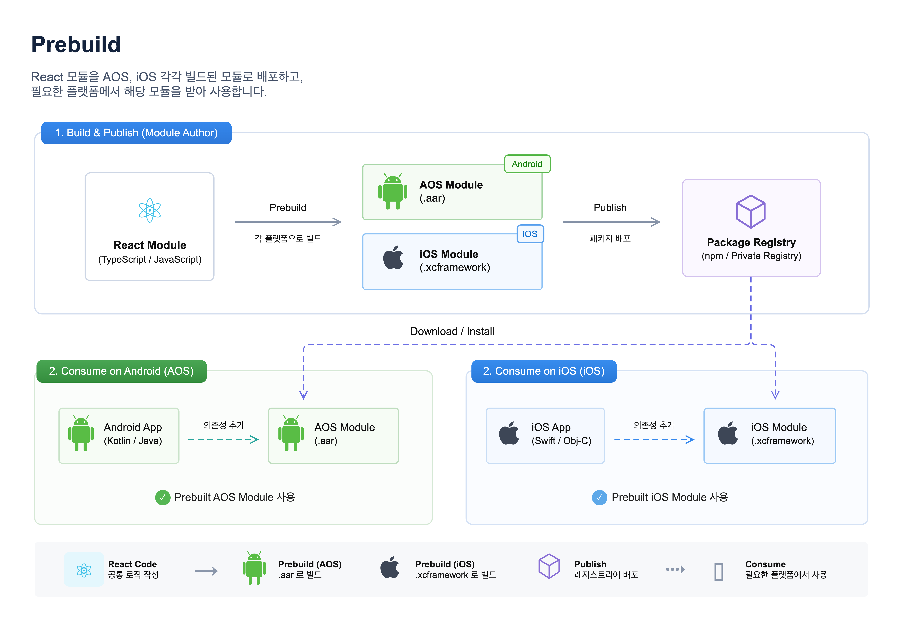

# PopPang RN

PopPang RN은 iOS와 Android에서 공통으로 사용할 화면을 React Native로 개발하는 프로젝트예요.

이 프로젝트에서는 두 가지 작업을 할 수 있어요.

- React Native 데모 앱을 실행해 화면을 개발하고 확인해요.
- iOS와 Android 네이티브 앱에 전달할 bundle과 프레임워크를 만들어요.

## 왜 Prebuild 방식인가요?

<!--  -->

이 저장소에서는 React Native 런타임과 네이티브 의존성을 먼저 빌드한 뒤, 클라이언트 앱에 산출물 형태로 전달하는 방식을 `Prebuild`라고 불러요. iOS는 `XCFramework`, Android는 `AAR`과 로컬 Maven 저장소로 패키징해서 배포해요.

이 방식을 택한 이유는 기존 네이티브 앱의 의존성 관리 체계를 흔들지 않기 위해서예요. React Native 공식 문서처럼 앱 프로젝트 안에 React Native를 직접 통합하면 클라이언트 앱도 `CocoaPods`나 React Native 빌드 설정을 함께 가져가야 할 수 있어요. 이미 `Swift Package Manager`, 사내 빌드 시스템, 기존 Gradle 구조를 쓰는 앱에 다른 의존성 관리 방식을 섞으면 중복 의존성, 충돌, 커스텀 히스토리 같은 운영 비용이 커져요. `Prebuild` 방식이면 클라이언트 앱은 React Native 프로젝트 자체를 품지 않아도 되고, 필요한 산출물만 받아 한 가지 통합 경로로 붙일 수 있어요.

## 구조

```text
App.tsx
= Debug에서는 데모 피처 목록을, Release에서는 기본 root feature를 여는 앱 루트

native-entry.js
= iOS / Android 네이티브가 붙이는 RN 진입점

PopPang-RN/
├─ App.tsx                           # 데모 앱 루트
├─ index.js                          # 개발 실행 진입점
├─ native-entry.js                   # 네이티브 앱 삽입용 진입점
├─ src/
│  ├─ PopPangNativeEntry.tsx         # 네이티브 전달값으로 feature 선택
│  ├─ demo/
│  │  └─ DemoFeatureCatalog.tsx      # 데모용 피처 목록
│  └─ Features/
│     ├─ poppangFeatures.ts          # feature 정의와 매핑
│     ├─ PopPangRNRootFeature.tsx    # 기본 root feature
│     └─ PopPangAdminFeature.tsx     # admin feature
├─ react_native_prebuild/
│  └─ iOS용 React Native XCFramework 생성 도구
├─ react_native_android_prebuild/
│  └─ Android용 React Native AAR 및 로컬 Maven 저장소 생성 도구
└─ scripts/
   ├─ bundle-ios.sh
   ├─ bundle-android.sh
   └─ release-rn.sh
```

## 프로젝트는 목적에 따라 진입점을 나눠 사용해요.

| 목적             | 진입점            | 동작                                                   |
| ---------------- | ----------------- | ------------------------------------------------------ |
| 데모 앱 개발     | `index.js`        | `App.tsx`가 데모 피처 목록을 보여줘요                  |
| 네이티브 앱 삽입 | `native-entry.js` | 전달받은 `feature` 값으로 `root/admin` 화면을 선택해요 |

## 세팅 방법

```bash
# 1. 저장소 복제
git clone https://github.com/team-PopPang/PopPang-RN.git

# 2. 프로젝트 폴더로 이동
cd PopPang-RN

# 3. 의존성 설치
npm ci
```

> 라이브러리를 추가하거나 삭제할 때만 `npm install`을 사용해요.  
> 그 외 개발 환경 설치와 릴리즈 빌드에는 `npm ci`를 사용해요.

## Demo 앱 실행 방법

```bash
# 1. Metro 개발 서버 실행
npm run start

# 2. 새 터미널에서 iOS 데모 앱 실행
npm run ios

# 3. 새 터미널에서 Android 데모 앱 실행
npm run android
```

## 모듈 배포 방법

```bash
# ./scripts/release-rn.sh 버전명
./scripts/release-rn.sh v0.1.0
```

릴리즈에는 플랫폼별 JavaScript bundle과 함께 다음 네이티브 패키지가 포함돼요.

- iOS: `poppang-rn-spm-v0.1.0.zip`
- Android: `poppang-rn-android-maven-v0.1.0.zip`

Android 네이티브 패키지만 로컬에서 확인할 때는 아래 스크립트를 사용해요.

```bash
./react_native_android_prebuild/build_aars.sh v0.1.0
```

## 클라이언트 앱(Android)

Android 패키지는 `poppang-rn-android` SDK AAR, npm 네이티브 모듈 AAR, React Native와 Hermes를 포함한 폴더형 Maven 저장소예요. SDK는 RN C++ ABI에 맞춘 debug/release AAR을 함께 제공하고 Gradle이 앱 빌드 타입에 맞는 변형을 자동 선택해요. 클라이언트 앱에는 `node_modules`나 React Native Gradle Plugin이 필요하지 않아요.

Android 클라이언트 앱에서는 아래 스크립트를 `scripts/download-rn-release.sh`로 두면 돼요. 지정한 릴리즈 버전의 Maven 저장소와 Android bundle을 한 번에 내려받아 적용할 수 있어요.

<details>
<summary>다운로드 스크립트 전체 보기</summary>

```bash
#!/usr/bin/env bash
set -euo pipefail

VERSION="${1:-v0.1.0}"
SDK_VERSION="${VERSION#v}"

REPO="team-PopPang/PopPang-RN"

MAVEN_ASSET_NAME="poppang-rn-android-maven-$VERSION.zip"
BUNDLE_ASSET_NAME="poppang-rn-android-bundle-$VERSION.zip"

ROOT_DIR="$(cd "$(dirname "$0")/.." && pwd)"

MAVEN_OUTPUT_DIR="$ROOT_DIR/Vendor/PopPangRN"
BUNDLE_OUTPUT_DIR="$ROOT_DIR/app/src/main/assets"
TMP_DIR="$ROOT_DIR/.rn-release-temp"

cleanup() {
  rm -rf "$TMP_DIR"
}
trap cleanup EXIT

echo "RN Android 릴리즈 다운로드 시작: $VERSION"

rm -rf "$TMP_DIR"
mkdir -p "$TMP_DIR"

echo "Android Maven 저장소 다운로드"
gh release download "$VERSION" \
  --repo "$REPO" \
  --pattern "$MAVEN_ASSET_NAME" \
  --dir "$TMP_DIR" \
  --clobber

echo "Android bundle 다운로드"
gh release download "$VERSION" \
  --repo "$REPO" \
  --pattern "$BUNDLE_ASSET_NAME" \
  --dir "$TMP_DIR" \
  --clobber

echo "압축 해제"
mkdir -p "$TMP_DIR/maven" "$TMP_DIR/bundle"
unzip -q "$TMP_DIR/$MAVEN_ASSET_NAME" -d "$TMP_DIR/maven"
unzip -q "$TMP_DIR/$BUNDLE_ASSET_NAME" -d "$TMP_DIR/bundle"

if [[ ! -d "$TMP_DIR/maven/repository" ]]; then
  echo "Maven repository를 찾을 수 없습니다." >&2
  exit 1
fi

if [[ ! -f "$TMP_DIR/bundle/android/index.android.bundle" ]]; then
  echo "index.android.bundle을 찾을 수 없습니다." >&2
  exit 1
fi

echo "Maven 저장소 적용"
rm -rf "$MAVEN_OUTPUT_DIR"
mkdir -p "$MAVEN_OUTPUT_DIR"
cp -R "$TMP_DIR/maven/repository" "$MAVEN_OUTPUT_DIR/repository"

echo "Android bundle 적용"
mkdir -p "$BUNDLE_OUTPUT_DIR"
cp \
  "$TMP_DIR/bundle/android/index.android.bundle" \
  "$BUNDLE_OUTPUT_DIR/index.android.bundle"

echo "다운로드 및 적용 완료"
echo "Maven 저장소: $MAVEN_OUTPUT_DIR/repository"
echo "Android bundle: $BUNDLE_OUTPUT_DIR/index.android.bundle"
echo "Gradle SDK 버전: $SDK_VERSION"
```

```bash
# 실행 권한 추가
chmod +x scripts/download-rn-release.sh

# v0.1.0 릴리즈 다운로드 및 적용
./scripts/download-rn-release.sh v0.1.0
```

앱 모듈 이름이 `app`이 아니면 스크립트의 `BUNDLE_OUTPUT_DIR`을 실제 모듈 경로에 맞게 바꿔요.

</details>

<details>
<summary>스크립트 없이 Android에 직접 적용하기</summary>

스크립트를 쓰지 않는 경우에는 아래 순서로 직접 적용할 수 있어요.

1. `poppang-rn-android-maven-v0.1.0.zip`은 앱 저장소의 `Vendor/PopPangRN`에 압축을 풀어요.
2. `poppang-rn-android-bundle-v0.1.0.zip`의 `index.android.bundle`은 앱의 `src/main/assets`에 복사해요.
3. `settings.gradle`에는 로컬 Maven 저장소를 등록해요.

```gradle
dependencyResolutionManagement {
    repositories {
        google()
        mavenCentral()
        maven {
            url = uri("$rootDir/Vendor/PopPangRN/repository")
        }
    }
}
```

앱 모듈에는 PopPang SDK 의존성 한 개만 추가해요.

```gradle
dependencies {
    implementation("com.poppang:poppang-rn-android:0.1.0")
}
```

React Native 화면은 SDK가 제공하는 Intent로 열어요.

```kotlin
// 전달값이 없으면 기본값으로 root feature가 열려요.
startActivity(PopPangRnSdk.createIntent(this))

// feature와 userUuid를 함께 넘기면 RN 화면에서 바로 사용할 수 있어요.
startActivity(
    PopPangRnSdk.createIntent(
        this,
        PopPangRnSdk.Feature.ADMIN,
        "test-user-uuid-1234"
    )
)
```

지원하는 feature 값은 다음과 같아요.

- `PopPangRnSdk.Feature.ROOT`
- `PopPangRnSdk.Feature.ADMIN`

</details>

## 클라이언트 앱(iOS)

- iOS 클라이언트 앱에서는 아래 스크립트를 `scripts/download-rn-release.sh`로 두면 돼요.
- 이 스크립트로 지정한 릴리즈 버전의 iOS bundle과 SPM 패키지를 내려받아 앱에 적용할 수 있어요.

<details>
<summary>다운로드 스크립트 전체 보기</summary>

```bash
#!/bin/bash
set -euo pipefail

VERSION="${1:-v0.1.0}"

REPO="team-PopPang/PopPang-RN"

BUNDLE_ASSET_NAME="poppang-rn-ios-bundle-$VERSION.zip"
FRAMEWORK_ASSET_NAME="poppang-rn-spm-$VERSION.zip"

ROOT_DIR="$(cd "$(dirname "$0")/.." && pwd)"

BUNDLE_OUTPUT_DIR="$ROOT_DIR/PopPangBrownField/Resources/ReactNative"
FRAMEWORK_OUTPUT_DIR="$ROOT_DIR/PopPangBrownField/Vendor/PrebuiltReactNativeFrameworks"

TMP_DIR="$ROOT_DIR/.rn-release-temp"

echo "RN 릴리즈 다운로드 시작: $VERSION"

rm -rf "$TMP_DIR"
mkdir -p "$TMP_DIR"

echo "iOS 번들 다운로드"
gh release download "$VERSION" \
  --repo "$REPO" \
  --pattern "$BUNDLE_ASSET_NAME" \
  --dir "$TMP_DIR" \
  --clobber

echo "SPM 패키지 다운로드"
gh release download "$VERSION" \
  --repo "$REPO" \
  --pattern "$FRAMEWORK_ASSET_NAME" \
  --dir "$TMP_DIR" \
  --clobber

echo "iOS 번들 압축 해제"
mkdir -p "$TMP_DIR/bundle"
unzip -o "$TMP_DIR/$BUNDLE_ASSET_NAME" -d "$TMP_DIR/bundle"

echo "SPM 패키지 압축 해제"
mkdir -p "$TMP_DIR/frameworks"
unzip -o "$TMP_DIR/$FRAMEWORK_ASSET_NAME" -d "$TMP_DIR/frameworks"

echo "iOS 번들 복사"
rm -rf "$BUNDLE_OUTPUT_DIR"
mkdir -p "$BUNDLE_OUTPUT_DIR"

cp "$TMP_DIR/bundle/ios/main.jsbundle" "$BUNDLE_OUTPUT_DIR/main.jsbundle"

if [ -d "$TMP_DIR/bundle/ios/assets" ]; then
  cp -R "$TMP_DIR/bundle/ios/assets" "$BUNDLE_OUTPUT_DIR/assets"
fi

echo "프레임워크 패키지 복사"
rm -rf "$FRAMEWORK_OUTPUT_DIR"
mkdir -p "$(dirname "$FRAMEWORK_OUTPUT_DIR")"

ditto \
  "$TMP_DIR/frameworks/PrebuiltReactNativeFrameworks" \
  "$FRAMEWORK_OUTPUT_DIR"

rm -rf "$TMP_DIR"

echo "다운로드 및 적용 완료"
echo "번들 위치: $BUNDLE_OUTPUT_DIR"
echo "프레임워크 위치: $FRAMEWORK_OUTPUT_DIR"
```

```bash
# 실행 권한 추가
chmod +x scripts/download-rn-release.sh

# v0.1.0 릴리즈 다운로드 및 적용
./scripts/download-rn-release.sh v0.1.0
```

</details>

<details>
<summary>SwiftUI에서 React Native 화면 열기</summary>

### 준비

- 다운로드한 `PrebuiltReactNativeFrameworks` SPM 패키지는 앱 타겟에 연결해 둬요.
- `main.jsbundle`은 앱의 `Copy Bundle Resources`에 포함해 둬요.
- `native-entry.js`에서 등록한 모듈 이름과 Swift의 `moduleName`은 같아야 해요.

```text
native-entry.js
  → PopPangRNRoot 등록
  → 내부에서 initialProperties.feature로 root/admin 선택
  → initialProperties.userUuid를 각 feature로 전달

Swift
  → moduleName: "PopPangRNRoot"
```

### 구현

```swift
import SwiftUI
import UIKit
import React
import React_RCTAppDelegate
import ReactAppDependencyProvider

// Debug에서는 Metro를, Release에서는 앱에 포함한 main.jsbundle을 사용한다.
final class ReactNativeDelegate: RCTDefaultReactNativeFactoryDelegate {
    override func sourceURL(for bridge: RCTBridge) -> URL? {
        bundleURL()
    }

    override func bundleURL() -> URL? {
#if DEBUG
        return RCTBundleURLProvider.sharedSettings()
            .jsBundleURL(forBundleRoot: "index")
#else
        if let url = Bundle.main.url(
            forResource: "main",
            withExtension: "jsbundle",
            subdirectory: "ReactNative"
        ) {
            return url
        }

        if let url = Bundle.main.url(
            forResource: "main",
            withExtension: "jsbundle"
        ) {
            return url
        }

        fatalError(
            """
            main.jsbundle을 찾을 수 없습니다.
            Build Phases > Copy Bundle Resources 설정을 확인해 주세요.
            """
        )
#endif
    }
}

// React Native Factory와 Delegate를 화면이 살아 있는 동안 유지한다.
final class ReactViewController: UIViewController {
    private let moduleName: String
    private let initialProperties: [String: Any]?

    private var reactNativeFactory: RCTReactNativeFactory?
    private var reactNativeFactoryDelegate: RCTReactNativeFactoryDelegate?

    init(
        moduleName: String,
        initialProperties: [String: Any]? = nil
    ) {
        self.moduleName = moduleName
        self.initialProperties = initialProperties
        super.init(nibName: nil, bundle: nil)
    }

    @available(*, unavailable)
    required init?(coder: NSCoder) {
        fatalError("init(coder:) has not been implemented")
    }

    override func viewDidLoad() {
        super.viewDidLoad()

        let delegate = ReactNativeDelegate()
        delegate.dependencyProvider = RCTAppDependencyProvider()

        let factory = RCTReactNativeFactory(delegate: delegate)

        reactNativeFactoryDelegate = delegate
        reactNativeFactory = factory

        view = factory.rootViewFactory.view(
            withModuleName: moduleName,
            initialProperties: initialProperties
        )
    }
}

// UIKit 기반 React Native 화면을 SwiftUI에서 사용할 수 있게 감싼다.
struct ReactNativeScreen: UIViewControllerRepresentable {
    let moduleName: String
    let initialProperties: [String: Any]?

    init(
        moduleName: String,
        initialProperties: [String: Any]? = nil
    ) {
        self.moduleName = moduleName
        self.initialProperties = initialProperties
    }

    func makeUIViewController(context: Context) -> ReactViewController {
        ReactViewController(
            moduleName: moduleName,
            initialProperties: initialProperties
        )
    }

    func updateUIViewController(
        _ uiViewController: ReactViewController,
        context: Context
    ) {}
}

struct ContentView: View {
    var body: some View {
        ReactNativeScreen(
            moduleName: "PopPangRNRoot",
            initialProperties: [
                // 값을 생략하면 기본 root feature가 열려요.
                "feature": "admin",
                "userUuid": "test-user-uuid-1234"
            ]
        )
        .ignoresSafeArea()
    }
}
```

### 동작 방식

```text
Debug
Metro의 index.js 로드
  → App.tsx
  → DemoFeatureCatalog 표시
  → 선택한 feature 표시

Release
앱에 포함된 main.jsbundle 로드
  → native-entry.js
  → initialProperties.feature, initialProperties.userUuid 확인
  → 값이 없으면 root, 값이 있으면 해당 feature 표시
```

</details>

## 의존성 추가

<details>
<summary>의존성 추가 방법</summary>

새 라이브러리는 프로젝트 루트의 `package.json`에만 추가해요.  
`npm install`을 실행하면 `package.json`과 `package-lock.json`이 함께 갱신돼요.

### 앱 실행에 필요한 라이브러리

React Native 화면에서 사용하는 라이브러리는 `dependencies`에 추가해요.

```bash
npm install react-native-safe-area-context
```

### 개발 도구

테스트, 린트, 빌드 도구는 `devDependencies`에 추가해요.

```bash
npm install --save-dev eslint-plugin-import
```

`react_native_prebuild/`에는 의존성을 추가하지 않아요.  
이 폴더는 프로젝트 루트의 `node_modules`를 사용해 iOS용 XCFramework를 만들어요.

`react_native_android_prebuild/`도 별도 npm 의존성을 갖지 않아요.

루트 `node_modules`에서 Android 네이티브 모듈을 찾아 AAR와 Maven metadata를 자동 생성해요.

</details>

## 참고

```bash
# 새 라이브러리를 추가하거나 삭제할 때는 `npm install`을 사용해요.
# 라이브러리 추가
npm install react-native-safe-area-context

# 라이브러리 삭제
npm uninstall react-native-safe-area-context
```

> 라이브러리를 추가하거나 삭제할 때만 `npm install`을 사용해요.  
> 그 외 개발 환경 설치와 릴리즈 빌드에는 `npm ci`를 사용해요.

## Troubleshooting

### React Native Core가 예전 레퍼런스와 다른 점

CocoaPods 없이 React Native를 구성하는 방법을 찾다가 좋은 레퍼런스를 발견했어요. 예를 들어 [CocoaPods 없이 React Native 개발하기](https://toss.tech/article/react-native-without-cocoapods)는 RN `0.76` 기준으로 `react_native_prebuild` 안에 별도 의존성을 두고 `yarn`, `pod install`로 XCFramework를 만드는 방식을 다뤄요.

하지만 최신 버전에서는 구조가 달랐어요. React Native `0.84.0`부터 iOS에서는 React Native Core precompiled binary가 기본값이 됐고, 이 저장소가 사용하는 `react-native@0.86.0`도 그 구조를 따라요. 그래서 예전 레퍼런스만으로는 현재의 `React-Core-prebuilt`, `RCT_USE_PREBUILT_RNCORE`, `RCT_USE_RN_DEP` 흐름을 바로 가져오기 어려웠어요.

그래서 이 저장소는 배포용 `react_native_prebuild/`에서 루트 `node_modules`를 의존성 원본으로 유지하고, `RCT_USE_PREBUILT_RNCORE=0`과 `RCT_USE_RN_DEP=0`으로 `React Core`와 `ReactNativeDependencies`를 source-build하는 방식으로 맞췄어요. 대신 Hermes는 Pods가 설치한 `hermesvm.xcframework`를 최종 패키지에 포함해요.

## Metro 캐시 초기화

```bash
pkill -f "react-native/cli.js start" || true
watchman watch-del-all || true
rm -rf $TMPDIR/metro-* $TMPDIR/haste-map-*

npm start -- --reset-cache
```


<!-- - `npm install`은 `package.json`과 `package-lock.json`을 함께 갱신해요. 변경한 `package.json`과 `package-lock.json`은 함께 커밋해요.
- `npm ci`는 `package-lock.json`에 기록된 정확한 버전을 설치해요. 처음 설치, CI, 릴리즈 스크립트에서는 항상 `npm ci`를 사용해요. -->

<!-- ## Bundle 산출물 생성
```bash
# iOS bundle 생성
npm run bundle:ios

# 산출물
# dist/ios/main.jsbundle
# dist/ios/assets

# Android bundle 생성
npm run bundle:android

# 산출물
# dist/android/index.android.bundle
# dist/android/res

# iOS / Android bundle 모두 생성
npm run bundle:all
``` -->

<!-- ## 흐름
```bash
# 데모앱 실행 순서
npm run ios / npm run android
        ↓
index.js
        ↓
App.tsx
        ↓
PopPangRNRoot.tsx
        ↓
화면 표시


# 실제 iOS/AOS 앱에 삽입될 때
iOS / Android 네이티브 앱 실행
        ↓
main.jsbundle 또는 index.android.bundle 로드
        ↓
native-entry.js
        ↓
PopPangRNRoot.tsx
        ↓
화면 표시
``` -->
